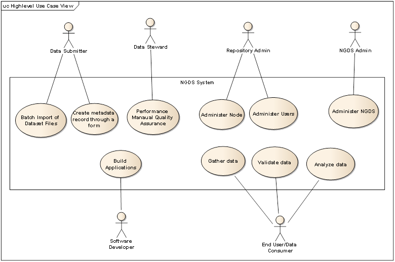
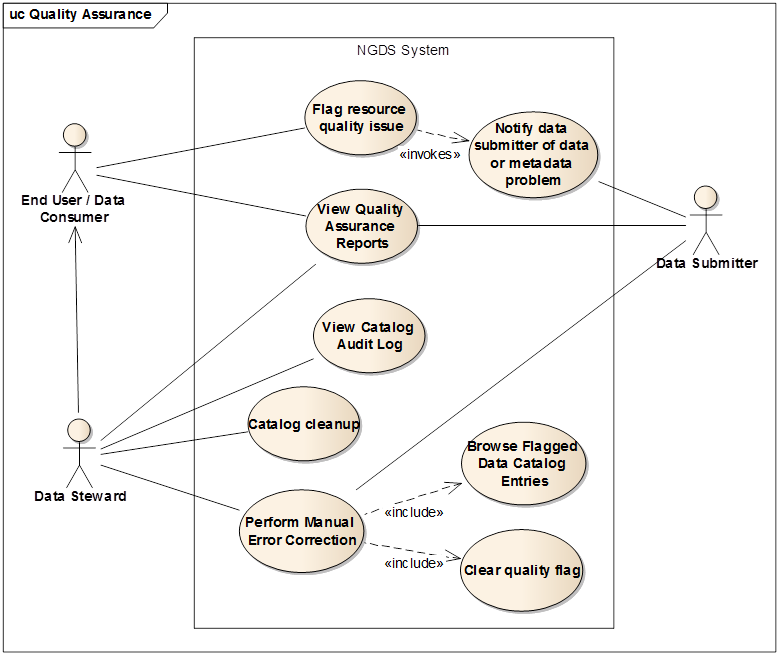
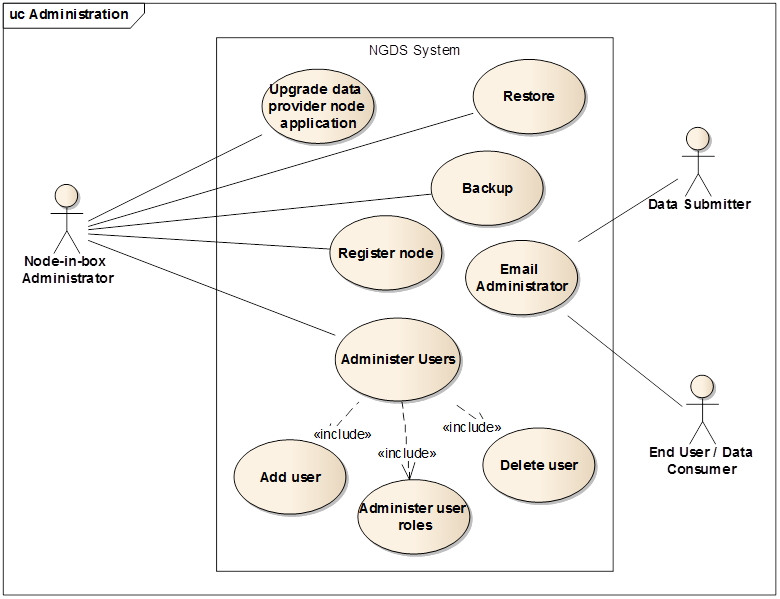
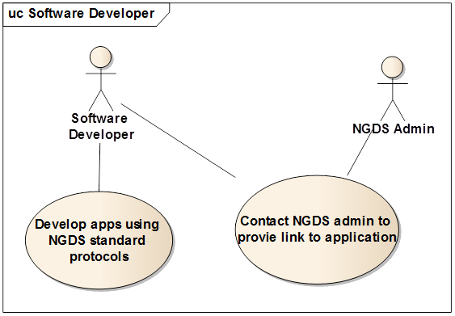
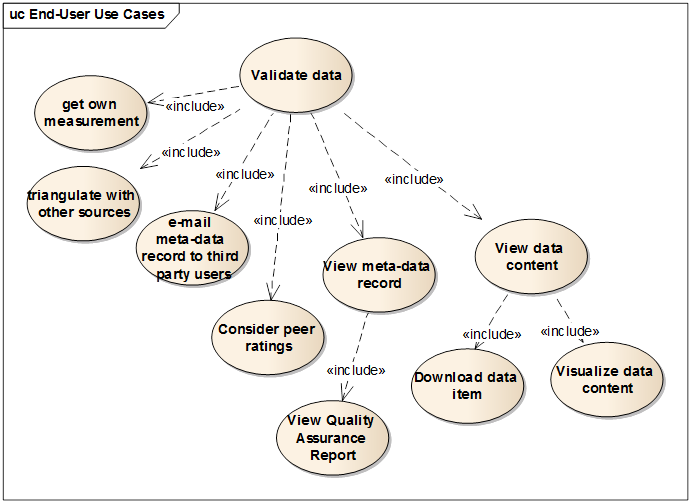
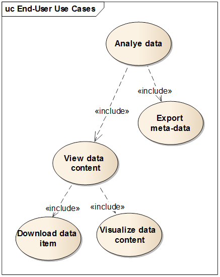
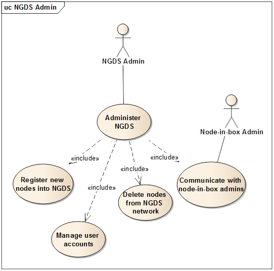

# Software Requirements Summary: National Geothermal Data System

based on Software Requirements Specification Version 2.7, 

dated 11/05/2012

Version History

 **Version** | **Author**      | **Date**   | **Reason**   |
------------ | ----------------| ---------- | ------------ |
|            | Stephen Richard | 2014-01-30 | Cull use cases and  requirement to create draft summary document. Highlight   statements of requirement or use case in red if not  achieved, green if achieved to some degree, yellow if not evaluated or there are other issues.  

## Executive Summary

This document is based on v2.7 of NGDS software requirements as
delivered by Siemens, dated 11/05/2012.  Most of the explanatory and cover material is removed to reduce the document to a list of use cases and requirements for quick reference and review of progress on meeting requirements as of January 2014

**Purpose of NGDS**

In the following we list the five basic needs that need to be realized by NGDS:

1.     NGDS shall enable data collectors to create and administrate a
repository for geothermal data.

2.     NGDS shall enable end users/data consumers to search geothermal
data across a multitude of repositories

3.     NGDS shall enable end users/data consumers to evaluate discovered
data

4.     NGDS shall enable end users/data consumers to acquire (i.e.
download) selected data

5.     NGDS shall enable the end users/data consumers to analyze
selected data

## Table Of Contents

[1       Introduction. 6](#_Toc378852679)

[1.1        Vision & Goal 6](#_Toc378852680)

[1.2        Notation in this document 6](#_Toc378852681)

[1.3        User Communities and Roles. 6](#_Toc378852682)

[1.3.1        Data Provider Community. 7](#_Toc378852683)

[1.3.2        Data Consumer Community. 8](#_Toc378852684)

[1.3.3        System Administrators. 8](#_Toc378852685)

[1.3.4        Software Developer Community. 8](#_Toc378852686)

[2       Overall system quality attributes. 9](#_Toc378855122)

[2.1        Maintenance. 9](#_Toc378855123)

[2.2        Usability & Accessibility. 9](#_Toc378855126)

[2.3        Performance and Scalability. 10](#_Toc378855127)

[2.4        Security. 10](#_Toc378855128)

[2.5        Supportability. 11](#_Toc378855130)

[2.6        Data Requirements. 11](#_Toc378855132)

[2.7        Design Constraints. 11](#_Toc378855133)

[2.8        Licensing Requirements. 12](#_Toc378855135)

[2.9        Applicable Standards. 12](#_Toc378855136)

[3       Node-in-a-box Software Package. 12](#_Toc378855137)

[4       End-User/Data Consumer Software. 14](#_Toc378855138)

[4.1        NGDS WebSite. 14](#_Toc378855139)

[4.2        NGDS WebApp. 14](#_Toc378855140)

[5       NGDS Data Access Protocols. 14](#_Toc378855141)

[6       Use Case Models. 15](#_Toc378855142)

[6.1        High-level Use Cases View.. 15](#_Toc378855143)

[6.2        Data Provider Use Cases. 16](#_Toc378855144)

[6.2.1        Data Submitter 16](#_Toc378855145)

[6.2.1.1.1      Upload new files. 16](#_Toc378855146)

[6.2.1.1.2      Update uploaded file. 17](#_Toc378855147)

[6.2.1.2.1      Process data file in NGDS content model template.
18](#_Toc378855148)

[6.2.1.3.1      Create metadata record through a form..
19](#_Toc378855149)

[6.2.1.3.2      Bulk upload metadata from metadata content template
table. 20](#_Toc378855150)

[6.2.1.3.3      Browse and manage resource directory and collections.
21](#_Toc378855151)

[6.2.1.3.4      Bulk update metadata records. 22](#_Toc378855152)

[6.2.2        Data Steward. 22](#_Toc378855153)

[6.2.2.1.1      View resource submission and update logs.
22](#_Toc378855154)

[6.2.2.2.1      View catalog audit log??. 24](#_Toc378855155)

[6.2.2.2.2      View quality assurance reports. 24](#_Toc378855156)

[6.2.2.2.3      Flag resource quality issue. 25](#_Toc378855157)

[6.2.2.2.4      Browse flagged data catalog entries. 25](#_Toc378855158)

[6.2.2.2.5      Perform manual error correction. 26](#_Toc378855159)

[6.2.2.2.6      Clear quality flag. 26](#_Toc378855160)

[6.2.2.2.7      Catalog cleanup. 27](#_Toc378855161)

[6.2.2.2.8      Notify data submitter of data or metadata problem..
28](#_Toc378855162)

[6.2.2.3.4      Make resource public. 28](#_Toc378855163)

[6.2.3        Node Administrator 29](#_Toc378855164)

[6.2.3.1.1      Administer users. 29](#_Toc378855165)

[6.2.3.1.2      Enrollment 30](#_Toc378855166)

[6.2.3.1.3      Add users. 31](#_Toc378855167)

[6.2.3.1.4      Delete users. 31](#_Toc378855168)

[6.2.3.1.5      Administer user roles. 32](#_Toc378855169)

[6.2.3.1.6      Backup. 32](#_Toc378855170)

[6.2.3.1.7      Restore. 33](#_Toc378855171)

[6.2.3.2.4      Register node. 33](#_Toc378855172)

[3.2.3.3.1      e-mail (NGDS or node-in-a-box) administrator
34](#_Toc378855173)

[6.2.3.3.4      Upgrade node-in-the-box application. 34](#_Toc378855174)

[6.3        Software Developer Use Cases. 35](#_Toc378855175)

[6.3.1        Develop Applications. 35](#_Toc378855176)

[6.3.1.1.1      Develop apps using NGDS standard protocols (needs
reformulating) 35](#_Toc378855177)

[6.3.2        Register New Application with NGDS. 36](#_Toc378855178)

[6.3.2.1.1      Contact NGDS admin to provide link to application.
36](#_Toc378855179)

[6.4        End-User Use Cases. 37](#_Toc378855180)

[6.4.1        Discover and Gather Data. 39](#_Toc378855181)

[6.4.1.1.1      Map-based search. 39](#_Toc378855182)

[6.4.1.1.2      Landmark-based search. 40](#_Toc378855183)

[6.4.1.1.3      Coordinate-based search. 40](#_Toc378855184)

[6.4.1.2.1      Keyword content-based search. 41](#_Toc378855185)

[6.4.1.3.1      Filter results by type. 41](#_Toc378855186)

[6.4.1.3.2      Filter results by metadata attributes.
42](#_Toc378855187)

[6.4.1.3.3      Filter results [geographically] on map.
42](#_Toc378855188)

[6.4.2        Validate and Evaluate Data. 43](#_Toc378855189)

[6.4.2.1.1      Browse/view metadata search results. 43](#_Toc378855190)

[6.4.2.2.1      View metadata record. 44](#_Toc378855191)

[6.4.2.2.2      Provide peer ratings. 44](#_Toc378855192)

[6.4.2.3.1      Triangulate with other sources. 45](#_Toc378855193)

[6.4.2.4.1      View data content 46](#_Toc378855194)

[6.4.2.4.2      Save selected search criteria. 47](#_Toc378855195)

[6.4.2.4.3      Load previous search criteria. 47](#_Toc378855196)

[6.4.2.4.4      e-mail metadata record URI to third party users.
48](#_Toc378855197)

[6.4.2.4.5      Subscribe to new data. 48](#_Toc378855198)

[6.4.3        Analyze and Visualize Data. 49](#_Toc378855199)

[6.4.3.1.1      Export metadata. 50](#_Toc378855200)

[6.5        System Administrator Use Cases. 51](#_Toc378855201)

[6.5.1.1.1      Register new nodes into NGDS.. 51](#_Toc378855202)

[6.5.1.1.2      Delete nodes from NGDS network. 52](#_Toc378855203)

[6.5.1.1.3      Communicate with the Node-in-a-box admin.
52](#_Toc378855204)

[6.5.1.1.4      Manage NGDS user accounts. 53](#_Toc378855205)

[6.6        Use cases common to all users. 53](#_Toc378855206)

[6.6.1.1.1      Login. 53](#_Toc378855207)

[6.6.1.1.2      Logout 54](#_Toc378855208)

[7       Acronyms, and Abbreviations. 54](#_Toc378855209)

1        Introduction 
=====================

This Software Requirements Specification (SRS) collects, organizes and
describes requirements for the NGDS software system captured through
use-case models, and from natural language requirements statements from
a sample of system users. These include functional requirements,
non-functional requirements (NFR), design constraints, and other factors
needed to provide a comprehensive picture of the software’s operation.

1.1      Vision & Goal 

The ultimate goal of the National Geothermal Data System (NGDS) is to
support the discovery of geothermal sources of energy. The NGDS will
provide online access to important geothermal-related data from a
network of data providers in order to:

       I.          Increase the efficiency of exploration, development
and usage of geothermal energy by providing a basis for financial risk
analysis of potential sites

     II.          Assist state and federal agencies in making land and
resource management assessments

    III.          Foster the discovery of new geothermal resources by
supporting ongoing and future geothermal-related research

   IV.          Increase public awareness of geothermal energy

1.2      Notation in this document {align="left" style="text-align:left"}
----------------------------------

[Comments from SMR 2014-01-30 are in brackets]

Red highlight -- not done or not working

Green highlight -- working to some degree

Yellow highlight -- other considerations, or SMR can't evaluate

1.3      User Communities and Roles 
-----------------------------------

User groups include the three main target groups defined in the System
Vision document, and Administrators who are responsible for maintenance
of the searchable catalog and entry-point web-application, as well
coordinating management of system-wide standards and protocols. User
groups or roles and their relationships are illustrated in Figure 2.

In Figure 2 we also outline the three main target user communities –
Data Provider, Software Developer, and End User. These communities are
discussed in general terms, with more detailed descriptions of their
respective use cases outlined in the next section.

 

Figure 2 Main user roles and their relationships

The National Geothermal Data System will be a network consisting of four
linked communities:

·        **Data providers** who will expose information to the system
through standardized, internet-accessible interfaces and interchange
formats****

·        **Data consumers** who will utilize the software and
information provided by the system in order to understand and develop
geothermal resources.

·        **Administrators** who are responsible for administrating and
monitoring the system. Typical tasks are installation and configuration,
user management, node monitoring, or system backup.

·        **Software developers** who will build applications that
utilize the data in the system, and make it easier for end-users to
interact with the system.

### 1.3.1    Data Provider Community 

Data providers represent the collection of users who will work together
to publicize information to NGDS through standardized,
internet-accessible interfaces using one of the supported interchange
formats. This community of users can be further broken down into several
distinct roles.

·        **Data Submitter**: the user who uses the NGDS protocols and
services to publish a piece of data[[DC1]](#_msocom_1) 

·        **Data Steward**: the user who maintains the quality of a piece
of published data

·        **Data Originator:**the person that created a piece of data,
e.g. a publication. The data originator is not an active actor in any of
the use cases involved in the NGDS: as soon as the originator wishes to
contribute to NGDS, they take on the role of Data Submitter

·        **Node-in-a-Box (or simply Node) Administrator**: the user who
is responsible for operating and maintaining an organization’s data
repository and insures that the data is provided according to NGDS
standards and protocols

 

#### 1.3.1.1  Data Submitter Role  

Data submitters will publish geothermal related data to NGDS.

#### 1.3.1.2  Data Steward Role  

The data steward user role will verify and maintain the quality of
published data. The data steward will have write access to data under
his or her responsibility.

#### 1.3.1.3  Node Administrator Role  

The node administrator is responsible for the administration of one of
the data repositories, or nodes, in the system.

### 1.3.2    Data Consumer Community  

Data consumer will utilize the software and information provided by the
system in order to understand and develop geothermal resources.

Specifically, Data Consumers will:

·        Search for the entire NGDS system utilizing the federated NGDS
catalog service either via the NGDS WebApp application, or potentially
any other catalog search application that operates with NGDS search
protocols and metadata interchange formats.

·        Visualize and explore data in map, text, or other graphic
presentations (as prioritized by user research findings).

·        Select and acquire data via service interfaces using NGDS
interchange formats

·        Access files in NGDS data repositories

·        Save and re-load search queries

·        Set filters to be notified as new data of interest is available
via the system

### 1.3.3    System Administrators  

The system administrator is responsible for the administration of system
components. Node administrators are responsible for their own node
(repository, WebApp and catalog), while the NGDS administrator is
responsible for the whole NGDS set of nodes, and the federated catalog
service.  The system administrator is also responsible for coordinating
review and adoption of system protocols and interchange formats and for
the registration of new interchange formats and associated schema.

### 1.3.4    Software Developer Community  

Software developers may build applications that access NGDS resources
using the protocols and standards outlined as part of the system
architecture.

2        Overall system quality attributes 
==========================================

In this section, we discuss overall system quality attributes that
further describe the conditions on which the system will function.

2.1      Maintenance --------------------

For those components that are designed within the project we require
unit tests to be available that test at least the minimum functionality.
In addition system integration tests are recommended but due to the high
costs of designing a system test toolkit this might not be possible with
the given time and resources.

**NFR001**[[smr2]](#_msocom_2) All project-developed source code shall
have comments at least on a per-class level.~~~~~~[?]~~

**NFR002**The System’s architecture shall be documented. [document
exists, needs maintenance]

**NFR003**[[smr3]](#_msocom_3) The System’s configuration parameters
shall be documented. ~~[?]~~

**NFR004**The System’s source code shall be covered by unit tests to at
least 50% of coverage. Regression tests will be run as part of the
software process. [?]

2.2      Usability & Accessibility  
----------------------------------

**NFR005a**The System shall provide a reasonably simple to use
installation tool: The tool shall install all required components
(potentially with the exception for Java and/ or Python)  and guide the
administrator through the initial configuration steps.

**NFR005**The system shall be cloud-ready: It must be available as an
archived Virtual Machine (or VM) that is ready to use after a few
configuration steps. Our main target is EX2(from Amazon) and other
providers that are able to boot a VM image)

**NFR006**The system shall include detailed instructions that guide the
user through the process of installation of one node and joining a grid.
[Document exists]

**NFR008** The project-developed graphical user interfaces shall use a
uniform look-and-feel for web applications, defined by the UX team.
Minor customizations will be possible by adjusting Cascading Style
Sheets, for example.

**NFR009**The project-developed applications shall provide online help
explaining how to perform user-related functions. [some help is
available, not context sensitive, no tooltips]

**NFR010**The project-developed applications shall present the user with
clear, understandable and accurate information explaining each task that
can be performed using the software.

**NFR011**The project-developed applications shall present the user with
human understandable error messages explaining the errors that occur
during user interactions. [many error messages are not helpful]

**NFR012**The key data import operations should be transactional.
i.e.****The user shall be able to abort operations before completion,
without any negative consequences. [?]

**NFR013**The project-developed applications shall provide a status
indicator showing the progress towards completion of user triggered
processing, search queries, exports and downloads.

**NFR013b**The system shall comply with the section 508 Amendment to the
Rehabilitation Act of 1973 section related to Web-based Intranet and
Internet Information and Applications. [not tested]~~[?]~~

**NFR013c**The system shall comply with the ISO/TS 16071, “Ergonomics of
human-system interaction – Guidance on accessibility for human-computer
interfaces. ~~[?]~~[not tested]

 

2.3      Performance and Scalability  
------------------------------------

We assume the system will be designed to support universities and data
providers within USA, with a maximum of 1000 concurrent users.

**NFR014**Each data provider node must be capable to maintain a list of
at least 100 other NGDS nodes for harvest or distributed search.

**NFR015**Each data provider node shall indicate it has taken action in
response to all user operations within 2 (two) seconds.

**NFR016** Each data provider node shall be capable of supporting up to
50 simultaneous authenticated, logged-in users.

**NFR017**Each data provider node shall be capable of handling at least
50 (fifty) HTTP requests every 1 (one) minute.

**NFR018** Each data provider node shall respond to every request from
the NGDS in no more than 10 (ten) seconds.

**NFR019**The System shall be able to handle the import of data files up
to 2GB in size.

**NFR020**The System shall be able to handle the import of up to 1000
data files in any one import operation.

**NFR021**The System shall support the storing of up to 100000 data
files in the import directory of each data provider.

**NFR022**The System shall support the storing of up to 500GBs of data
files in the import directory of each data provider.

** **

2.4      Security  
-----------------

**NFR024**The System shall embody a security plan and process to ensure
that unauthorized users are denied access.

**NFR025**Valid login authentication is required for all data submitter,
steward, and administrator functions.

**NFR026**The System shall only allow users access to write data they
have permissions to write

**NFR027**The System shall only allow users access to download data
files they have permissions to download

**NFR028**The System shall only allow the data steward for a resource
permission to delete it.

**NFR029**The communication between end-users and the services of the
system will be encrypted using HTTPS protocol.

**NFR030**Data communications between the External Systems and NGDS
applications shall be secured by message authentication where
applicable/necessary.

**NFR031**A data provider node shall only transmit data to clients when
the data is published by an authenticated data submitter or steward for
access by that client’s permission group.

**NFR032**The data provider node shall maintain the integrity and
availability of all data stored in its local data store.

**NFR033**The data provider node shall maintain the integrity of all
files stored in the node’s local file repository.

**NFR034**The data provider node shall maintain a log of activities for
auditing purposes. [Data submission, updates to metadata are logged, not
clear if anything else is logged]

**NFR035**NGDS applications shall be developed considering good security
coding practices, thus minimizing vulnerability to attacks. In
particular, it should comply with FIPS (Federal Information Processing
Standards)

2.5      Supportability 
-----------------------

Here follows the requirements that enhance the supportability and
maintainability of NGDS project-developed software.

**NFR036**NGDS software shall be written using the standard coding style
for the used programming languages. For example, Oracle Java Coding
Styles, if Java turns out to be the selected language.

**NFR038**NGDS software shall be designed utilizing the concept of
encapsulation. Components shall be created that encapsulate related
functionality within them, and nothing else.

**NFR039** All software shall be modular to minimize the time and
complexity involved in maintaining and extending the platform and
application. [needs refactoring]

**NFR040**NGDS software shall not contain any statically detectable dead
code. [Adrian reports significant dead code; no static detection tests
run]

2.6      Data Requirements 
--------------------------

The Data Assessment Team will inventory additional data to be submitted
by project subcontractors, and project management will prioritize
datasets for delivery based on recommendations from the Domain Steering
Committee and User-Centered design team. A prioritized list of important
geothermal data types will be ascertained and used as the basis for
populating NGDS data assets. See the Data Requirements Specification
[/P02/](#P02_GTDA_Data_Requirements_Spec), for a description of data
categories and attributes that will be stored in the System’s database.

2.7      Design Constraints  
---------------------------

The follow requirements are derived from design decisions that represent
constraints that are mandated and must be adhered to.

**NFR041** The NGDS components shall interface to NGDS data provider
nodes via NGDS web services.  [CKAN API is used between web application
and server]

**NFR042** The NGDS components shall use the API provided by NGDS web
services for data functions, for example WCS, WFS. [Data browse and view
from WFS and WMS is supported, uses CKAN API for tabular (csv) datasets]

**NFR043** The NGDS participants shall use a data abstraction layer for
access to databases used for metadata management and management of data
in NGDS content models. [Unclear how this is to be tested]

**NFR044** The system components shall use web services for
communication with NGDS client software and other NGDS nodes.

**NFR045**The NGDS components shall use web services to send data to
NGDS client applications, including the NGDS portal application. [CKAN
API?]

**NFR046** The NGDS components shall use web services for the querying
of data from NGDS nodes.

**NFR047**The system shall provide requested metadata to the NGDS as XML
files [transactions from web portal to server use CKAN JSON??]

**NFR048** NGDS metadata catalog services shall provide metadata search
results using the USIGN ISO XML encoding profile in response to CSW
2.0.2 protocol. [need to test CKAN csw more]

**NFR049** The software shall be designed with Linux as its main target
platform. However, as much as possible, it shall utilize portable
technologies such as Java, that will facilitate its porting to other
operating systems and platforms.

**NFR050** Under no condition should the failure of one node be capable
of crippling or rendering the entire NGDS system useless.  The system
must be capable of adding or removing nodes while maintaining normal
operations.

2.8      Licensing Requirements  
-------------------------------

The software system being developed as part of the project shall have an
open source license variant. The license will include provisions to
allow users to copy, distribute and transmit the software, to adapt the
software for other applications, and to make commercial use of the
software, under the condition that the following attribution for the
source of the software is included in any copy or derived work:

In order to preserve the original NGDS licensing terms, the use of third
party libraries and application servers that violate these terms will be
vetted.

The data provided by the data providers will not be made available to
the public domain until it is released and published through the
“publish” feature of the System.  Other access control constraints may
be applied by individual nodes at their discretion.

2.9      Applicable Standards  
-----------------------------

See the WSS [**/P05/**](#P05_GTDA_Web_Services_Specification) for the
details of the web services standards to be applied.

3        Node-in-a-box Software Package 
=======================================

A redistributable, node-in-a-box, free/open-source software package will
be developed (composed of an NGDS repository, an NGDS catalog and an
NGDS Desktop as shown in Figure 13).

The SCR development team will deliver the NGDS node-in-a-box software
stack (WepAPP, NGDS Repository and NGDS catalog) to BSU project
management team for deployment, testing and acceptance on a server of
their choice, in accordance to the project’s schedule.

The NGDS node-in-a-box software **will be delivered** as an installable
application to BSU project management for deployment, testing and
acceptance on a server of their choice, in accordance to the project’s
schedule.

The software package **will include** an installation program in the
form of a shell script of an apt package for Ubuntu Linux.

This node-in-a-box software application will

1.     give data providers a simple way to register data sources, load
data and expose those data as a node in the NGDS network

2.     support batch import and upload of shared datasets in supported
formats adhering to standard content models

3.     WebApp, user interface will be provided to help users upload data
to the system.

In this arrangement, different node-in-a-box instances can co-exist in
the system. This requires their catalogs to be synchronized via a
federation service or some sort of aggregating catalog.

 

Figure 13 NGDS Data Provider Software Package

 

NGDS will

1.     Facilitate publication, visualization and discovery of geothermal
data using services and applications.

2.     Provide a catalog, a web top UI and a data repository
application.

3.      NGDS System Administrator can install and manage data providers,
granting them the ability to publish data to the system

4        End-User/Data Consumer Software  
========================================

The project will implement two primary access points: a NGDS website and
a NGDS WebApp application. As much as possible, these will be integrated
in order to appear to the end-user as a single web-based experience. The
primary access point to the system will be the NGDS WebApp application.

4.1      NGDS WebSite  
---------------------

The website will be designed to

1.     provide information about all the NGDS participants

2.     serve as gateway to the system to discover data and applications
that utilize NGDS resources

3.     include information on the project’s progress, NGDS
specifications, access to the map-centric search application, other
software applications utilizing NGDS services, NGDS presentations,
documentation and tutorials, a link to the catalog of NGDS nodes, and
any other results as they become available.

4.2      NGDS WebApp  
--------------------

A user-friendly, web-based application will be created in order to
support

1.     finding, visualizing, mapping, and acquisition of data by
end-users/data consumers

2.     provide a user interface that allows end-users/data consumers to
discover and access resources made available across all NGDS nodes

3.     search for data across the system based on topic, location, time
or other criteria

4.     provide the user with the information necessary to determine the
utility of that dataset for their purposes.

5.     visualize Geographic datasets through a map interface that will
also allow users to inspect the details of individual data points (e.g.
wells, temperature measurements, etc.) from properly formatted datasets.

6.     provide a user interface for node-in-a-box data providers to
publish data to their NGDS data repositories.

Note that the map UI is not intended for analysis and comparison of
different data layers. It works only as a graphical way for searching
data in the map and inspecting individual elements metadata.

5        NGDS Data Access Protocols {align="left" style="text-align:left"}
===================================

The OGC Catalog Service for the Web (CSW 2.0.2) will be used to enable
catalog search via a Web API. Data services will be implemented using
OGC WMS, WFS, NetCDF services, as well as other services adopted by the
technical and steering committee as the system evolves. File-based
resources will be accessed using standard HTTP GET requests.

6        Use Case Models  
========================

In general, the use cases for NGDS system are organized by user category
as follows.

·                  Data Provider Use Cases

·                  End-user/Data Consumer Use cases

·                  System administration Use Cases

·                  Software Developer Use Cases

When certain tasks or workflows require multiple users to collaborate,
they will be represented as workflow use cases, such as Quality
Assurance Workflow.

6.1      High-level Use Cases View  
----------------------------------

Figure 3: High-level Use Case View

 

6.2      Data Provider Use Cases 
--------------------------------

Figure 4 : Data Entry and Submission Use Case View

### 6.2.1    Data Submitter  

#### 6.2.1.1  File Uploads  

Use Case ID

**UC\_001a**

Use Case Name

##### 6.2.1.1.1       Upload new files  

**Short Description**

The goal of this use case is to allow data submitters to upload one or
more files to be stored in the NGDS data repository. After the upload,
the submitter will also update the metadata record of that file, thus
allowing it to be cataloged.

We assume the file is opaque, i.e. stored as is, with no further content
parsing.

**Actors**

Data submitter

Pre-Conditions

Data submitter is properly authenticated;

Success End Conditions

The files are successfully uploaded and stored in the NGDS repository

The metadata record for the provided file is successfully created

The metadata remains “private”, waiting to be made public by a data
steward

Data

Metadata attributes for the specific data type as input to the form

Files to be uploaded

Geographical location of files

Functions

·        Upload files

·        Form-based metadata input for specific data type

·        Auto-complete of user contact information

·        metadata validation

·        URI creation

·        Metadata duplicate detection

·        Tagging of metadata with geographical information

·        Converting non-standard location coordinates into
latitude/longitude and shapes.

·        Log changes to metadata log file

Variants

Step

Actor

Description

7b

NGDS System

In case of duplicates, or incomplete information in the form, the system
will provide a failure notification message, indicating the type of
error.

The user-provided metadata form will be presented to the Data Submitter
for correction

7c

Data Submitter

Will correct the form data and resubmit for validation or will quit the
import procedure.

Exceptions

Step

Actor

Description

 

NGDS System

In case of internal file upload/metadata record creation failure, the
system will roll back all existing transactions, returning to its
previous state.

Open Issues (Please use this field to indicate questions/comments on the
use case)

ID

Issue Description

1

Can't it be assumed that the submitter is working in cahoots with the
data steward?  Can the approval step be short circuited by assigning
both submitter and steward roles to an individual? Yes, it is possible.

2

IN step  9, perhaps the data steward should be notified that there is a
new record to be approved?  This could be done by the NGDS system once
the data submitter confirms the upload is completed?

 

 

Use Case ID

**UC\_001b**

Use Case Name

##### 6.2.1.1.2       Update uploaded file  

**Short Description**

The goal of this use case is to allow data submitters to update a file
that has been uploaded. This process includes the update of the metadata
record of the file.

We assume the file is opaque, i.e. stored as is, with no further content
parsing.

**Actors**

Data submitter

Pre-Conditions

Data submitter is properly authenticated;

Success End Conditions

The file is successfully updated and new content stored in the NGDS
repository

The metadata record for the provided file is successfully updated

The entry for the new file is also propagated & updated in the NGDS
catalog.

Data

Possible new metadata record changes

Files to be uploaded

Functions

·        Upload files

·        update metadata

·        replace existing file.

·        Log changes to metadata log file

Variants

Step

Actor

Description

4b

NGDS System

In case of duplicates, or incomplete information in the form, the system
will provide a failure notification message, indicating the type of
error.

The user-provided metadata form will be presented to the Data Submitter
for correction

4c

Data Submitter

Will correct the form data and resubmit for validation or will quit the
import procedure.

Exceptions

Step

Actor

Description

 

NGDS System

In case of internal file upload/metadata record update failure, the
system will roll back all existing transactions, returning to a valid
state.

Open Issues (Please use this field to indicate questions/comments on the
use case)

ID

Issue Description

1

What happens to the old file? Is it deleted in the database or DOEs it
remain there? Is a history of all metadata changes kept?

DN:  This is a good question and one that probably has no right answer
for everyone.  Does the new item get a new UUID or is it a revision
(version X++) of the existing item?    Earlier in the document there is
a statement that says “all” node interactions are logged.  This might
require that the old version stay there.  Probably best to ask domain
experts.

#### 6.2.1.2  Data Processing  

Use Case ID

**UC\_006**

Use Case Name

##### 6.2.1.2.1       Process data file in NGDS content model template  

**Short Description**

This allows data submitter to process (upload/parse) a file to NGDS data
provider nodes.

The difference between the upload/update file use cases is that the file
here is formatted according to an existing template, and therefore, can
be parsed and checked for correctness. Processing will include
validation of data schema, loading data into a data store on the
provider node.

**Actors**

Data Submitter

Pre-Conditions

Requires authentication, access permission to edit metadata records.

File must be formatted according to one of the NGDS content model
templates (See /P02/ data specification from Arizona State University,
for supported file formats and content models

Success End Conditions

File is submitted to a repository, being accessible through a valid URI

Data

Files properly formatted according to NGDS supported formats

Functions

·        import data files

·        Validate data file content & formats

·        Log changes to metadata log file

Variants

Step

Actor

Description

3b

Data Submitter

Is notified of suboptimal data content

Chooses to submit the data anyways

3c

NGDS system

Accepts the file, flags the problems with content or metadata

Hand file over to the data steward

Exceptions

Step

Actor

Description

 

NGDS System

In case of internal import failure, the system will roll back the
existing transaction, returning to a valid previous state.

Open Issues (Please use this field to indicate questions/comments on the
use case)

 

#### 6.2.1.3  Metadata Generation {align="left" style="text-align:left"}

 

Use Case ID

**UC\_003**

Use Case Name

##### 6.2.1.3.1       Create metadata record through a form {align="left" style="text-align:left"}

**Short Description**

The goal of this use case is to allow data submitters to create a
metadata record describing a resource (tier1, tier2 data) by input of
information manually through a form interface for inclusion in the NGDS
catalog.

**Actors**

Data submitter

Pre-Conditions

Data submitter is properly authenticated;

Data is available through one of the NGDS data repositories, and is
identified through a valid URI.

Metadata includes the geological location of the geological feature
associated to the data.

Success End Conditions

The meta-data for the provided geological feature is successfully
imported into the NGDS catalog

The data remains “private”, waiting to be made public by a data steward

Data

Metadata attributes for the specific data type as input to the form

Functions

·        Form-based metadata input for specific data type

·        metadata validation

·        URI validation

·        Metadata duplicate detection

·        Tagging of metadata with geographical information

·        Converting non-standard location coordinates into
latitude/longitude and shapes.

·        Log changes to metadata log file

Variants

Step

Actor

Description

7b

NGDS System

In case of duplicates, invalid URIs or incomplete information in the
form, the system will provide a failure notification message, indicating
the type of error.

The original metadata form will be presented to the Data Submitter for
correction

7c

Data Submitter

Will correct the form data and resubmit for validation or will quit the
import procedure.

Exceptions

Step

Actor

Description

 

NGDS System

In case of internal import failure, the system will roll back all
existing transactions, returning to a valid state.

Open Issues (Please use this field to indicate questions/comments on the
use case)

ID

Issue Description

2

In case of duplicates, which one is the most important the new instance
of the data or the existing version of it? How to resolve these
conflicts?

DN: The domain experts said if records are overlapping, they would want
both.  If they are truly identical, it doesn’t really matter does it
(from a pure logic perspective anyways).

3

What if the user DOEs not provide a geo-location to the data?

DN: Given the UCD feedback, a geospatial reference is mandatory for
every record for map based searching.

 

 

Use Case ID

**UC\_004a**

Use Case Name

##### 6.2.1.3.2       Bulk upload metadata from metadata content template table {align="left" style="text-align:left"}

**Short Description**

The goal of this use case is to allow data submitters to import a CSV
file containing metadata into the NGDS catalog.

New records will be marked ‘submitted’; Data Steward will then have
option to review metadata through forms interface; records will become
visible to public when marked ‘published’. Metadata will be validated
for content completeness, URLs checked for http 200 responses, and new
metadata record will be run through a duplicate-detection process to
identify existing metadata that may already describe the resource.

**Actors**

Data Submitter

Pre-Conditions

Data submitter is properly authenticated;

Individual data items, referenced to in the CSV file are available
through one of the NGDS data repositories, and is identified through a
URI.

Metadata includes the geological location of the feature associated to
the data.

CSV file containing metadata in table form according to the NGDS
Compilation template Metadata Excel workbook

Success End Conditions

The meta-data for the provided geological feature is successfully
imported into the NGDS catalog.

The imported data remains private, waiting for the Data Steward to make
it public.

Data

CSV file containing resources metadata, formatted according to the NGDS
compilation template metadata excel workbook.

Functions

·        process NGDS metadata compilation template csv file to produce
individual metadata records

·        metadata validation

·        URI validation

·        Metadata duplicate detection

·        Converting non-standard location coordinates into
latitude/longitude and shapes.

·        Log changes to metadata change log file

Variants

Step

Actor

Description

11b

NGDS System

Rejects data based on invalid records

Exceptions

Step

Actor

Description

 

NGDS System

In case of internal import failure, the system will roll back the
transaction, returning to a previous valid state.

Open Issues (Please use this field to indicate questions/comments on the
use case)

ID

Issue Description

1

SMR 2014-01-30 the bulk uploader does not use the NGDS metadata
compilation template; the functions in the original 'requirements'
document were copied from other metadata use cases, not specific to
processing bulk metadata listing.

 

Use Case ID

**UC\_008**

Use Case Name

##### 6.2.1.3.3       Browse and manage resource directory and collections {align="left" style="text-align:left"}

**Short Description**

Allows the User to view & manage all of the resources (or datasets)
under their stewardship (data steward) or that they have submitted (Data
submitter), based on metadata describing the resources. The resource
listing will be presented to the User in a tree view directory
structure.

Users can define collections (folders, subdirectories) to organize the
listing according their needs. A resource may be assigned to multiple
collections.  Access control may be assigned at the collection level.
The display should indicate clearly any resources that have quality
issue flags attached

**Actors**

Data submitter, Data Steward

Pre-Conditions

Requires authentication, access permission to view & edit individual
user metadata records & datasets.

Success End Conditions

Users can adequately manage (create, rename, delete) resources

Users can assign resources to collections (updating metadata)

Users can delete existing resources (and their associated metadata)

Metadata is kept in synchrony with changes in the collection

Data

Resources: metadata records or files

Functions

·        Visualize flagged resources with quality issues

·        Create, delete, reorganize resource collections

·        delete resources

·        Visualize resources & collections

Variants

Exceptions

Open Issues (Please use this field to indicate questions/comments on the
use case)

ID

Issue Description

1

It seems to me that, in this view, the only operation that users can do
with resources is delete. (Importing  and modification of resources must
be done in other views). Is it correct?

2

Missing requirements: tree-view portrayal of resource hierarchy. More
clarity required as to who can create collections and sub-collections at
what levels in the hierarchy. [Data steward assigns permissions to
create public collections; perhaps allow authenticate users to define
personal collections that they persist in a user workspace to use
between sessions]. How do permissions work if metadata can belong to
more than one collection? [Metadata record has only one owner; do we
need a use case for reassigning ownership of a metadata record?] If a
record is part of one collection and I have edit privileges to that
collection, but it is also included in another collection to which I do
not have privilege, what are my options? [Looks like assigning access
control at collection level won’t work; work access control through
users and group membership, with permissions at group level to share
edit capabilities]

 

SMR 2014-01-30. Only part of this implemented is to see list of
resources for a given account and to delete metadata (not tested--does
uploaded file or deployed service get deleted?) and edit metadata. No
collection/group functionality implemented. Add 'and collections' to
title; that should be a separate use case but is bundled in here.

 

Use Case ID

**UC\_005**

Use Case Name

##### 6.2.1.3.4       Bulk update metadata records

**Short Description**

Metadata records may be selected based on a content-based filter query
based on fields as contact information or linkage URIs. Once selected,
those records can be replaced using regular expressions. User selects
metadata content item to update, value to replace, and new value to use.

**Actors**

Data submitter, Data steward, System administrator

Pre-Conditions

Requires authentication, access permission to edit metadata records.

Success End Conditions

All relevant metadata record attributes that match the search criteria
are replaced with the new value defined by the user

Data

Specific fields of metadata records: contact information and URIs

Functions

·        Search & replace of metadata record attributes based on simple
regular expressions

·        Log changes to metadata log file

Variants

Exceptions

Step

Actor

Description

 

NGDS System

In case of internal import failure, the system will roll back all
existing transactions, returning to a valid state.

Open Issues (Please use this field to indicate questions/comments on the
use case)

ID

Issue Description

1

How interactive should be the process of search & replace?

 

### 6.2.2    Data Steward 

#### 6.2.2.1  Activity Logs 

 

Use Case ID

**UC\_007 & UC\_046**

Use Case Name

##### 6.2.2.1.1       View resource submission and update logs 

**Short Description**

Allows authorized users to view the logs for metadata record creation,
file uploads to file repository, and processing of NGDS files that
conform to valid content model templates.

These logs are created during any data submission or update activity.

**Actors**

Data submitter, Data Steward, System administrator

Pre-Conditions

Requires authentication, access permission view metadata records import
logs.

These logs are created during any data submission or update activity, so
at least one data submission must have occurred.

Success End Conditions

Successful and correct visualization of data submission logs.

No missing logs

Data

Data submission logs containing details such as time of activity,
actions taken, data submitter, Data Steward, size of data, submitter
comments, etc

Functions

·        Submission log capture

·        Submission log visualization

Open Issues (Please use this field to indicate questions/comments on the
use case)

ID

Issue Description

1

Missing requirements detailing the logs and their creation. What exactly
is logged? Also, how is the log portrayed to the user, or is that too
much in the realm of design?

 

SMR 2014-01-30 currently see list of create and update events via the
dashboard when logged in; this is working in at least a rudimentary way.

#### 6.2.2.2  Validation and Quality Assurance Logs 

Figure 5 Quality Assurance Use Case View

 

Use Case ID

**UC\_046**

Use Case Name

##### 6.2.2.2.1       View catalog audit log?? 

**Short Description**

At every change the system creates a log for a given catalog item. This
use case allows authorized users to view the log of all changes made to
a data or metadata record, changes made both manually and automatically.

**Actors**

Administrator, Data Steward

Pre-Conditions

An audit log of catalog changes has been created and actively updated by
the system

Success End Conditions

Users are able to visualize the change logs for a given record

Data

Catalog audit log

Functions

·        View catalog audit log

Variants

Exceptions

Open Issues (Please use this field to indicate questions/comments on the
use case)

ID

Issue Description

1

Missing requirements detailing the validation and generation of the
validation log. Here are two, but where are ones about URL checking?
Syntax? Is the validation log attached to the activity log for a
particular resource?

2

DN: I am also confused if this is happening at the node or NGDS system
level?  If another node change must be recorded in every other node,
this could get quite messy fast (math suggests that it would be equal to
((N \* (N^2^ – 1) \* R) \* MR) where N is the number of nodes, R is the
number of records and MR is the number of metadata records and that is
assuming a 1:1 relationship between instances or R and MR.

 

SMR 2014-01-30  I can't tell what this is supposed to be about, and how
its different from **UC\_007 & UC\_046 (3.2.2.1.1)**

 

Use Case ID

**UC\_042**

Use Case Name

##### 6.2.2.2.2       View quality assurance reports 

**Short Description**

Allows the Data submitter or Data Steward to view quality assurance
reports for resources they submit or maintain.

Quality assurance can be automatic or manual. As an automated process,
it is performed by NGDs during import, flagging possible typos and
simple input errors in the metadata being managed by the system

As a manual process, it involves users that see possible issues and flag
them in the data records.

**Actors**

Data Submitter, Data Steward, End User/Data Consumer

Pre-Conditions

The metadata record has been imported into NGDS catalog and a set of
quality assurance functions were automatically ran in those records. As
a result, the metadata records were flagged for possible errors.

Users have write access to the data i.e. they are either submitters or
stewards of that data

Success End Conditions

Users are able to identify the flagged errors in the metadata they
provide or maintain

Data

Metadata records, Quality Report

Functions

·        Visualize quality assurance report

Variants

Exceptions

Open Issues (Please use this field to indicate questions/comments on the
use case)

ID

Issue Description

1

Should consumers be able to see QA reports?  If they are not addressed,
it seems like it would serve as a good "warning" to analysts.

The Quality Report is for steward and submitter consumption, with lots
of details that may not be relevant to End Users, e.g. wrong measures,
duplicated fields. We assume the steward will fix them before making the
data public. However, some stewards may want to make that data public
anyway, in that case, consumers could benefit from this information.

 

Use Case ID

**UC\_043**

Use Case Name

##### 6.2.2.2.3       Flag resource quality issue {align="left" style="text-align:left"}

**Short Description**

Allows authorized & authenticated End-User/Data Consumer to create a
flag, indicating that some issue exists with the quality of a data or
metadata record. The process creates an annotation record documenting
the dataset, URI for the resource in question, identity of the user
raising the flag, timestamp. The annotation record should also include
notes on resolution process, who, when, what.  Flagged resources should
be clearly marked

**Actors**

Data Steward. End User/Data Consumer

Pre-Conditions

The metadata record has been imported into NGDS catalog.

Metadata QA records can be modified by any user in the system

Success End Conditions

Users are able visualize metadata records, and to provide quality
assurance feedback to these records as they see fit.

Data

Metadata records (read only)

Metadata QA (quality attribute) records (read/write)

User information

Functions

·        Manually flag resource quality issues

Variants

Step

Actor

Description

1b

End User/Data Consumer

End user can flag data records directly on the metadata visualization
page, without going to the quality assurance page.

Exceptions

Open Issues (Please use this field to indicate questions/comments on the
use case)

 

Use Case ID

**UC\_046c**

Use Case Name

##### 6.2.2.2.4       Browse flagged data catalog entries {align="left" style="text-align:left"}

**Short Description**

Allows Users to navigate through the catalog of resources that have had
their quality flagged for correction. A special view of the resource
browse list, filtered for records that have quality flags raised from
those that do not have them

**Actors**

Data Steward, Data Submitter

Pre-Conditions

a list of metadata resources is available, allowing filtering by quality
attribute flag

Success End Conditions

Users are able to identify flagged entries in the metadata catalog

Data

Metadata record

Functions

·        Browse data catalog entries

·        Filter catalog entries by flagged attribute

Main Sequence

Variants

Exceptions

Open Issues (Please use this field to indicate questions/comments on the
use case)

 

Use Case ID

**UC\_044**

Use Case Name

##### 6.2.2.2.5       Perform manual error correction {align="left" style="text-align:left"}

**Short Description**

Allows a Data submitter or Data Steward to manually address issues
present in a data or metadata record that has been flagged for having
quality issues. Note that this process may require resubmission of data
files.

Quality check and error editing will be built into the data submission
process, but will require the steward to access the data in the
appropriate environment for quality issues recognized after a submission
is complete. The process will require the reviewer to make a note that
is recorded as annotation on the record, along with the identity of the
reviewer and a time stamp.

**Actors**

Data Submitter, Data Steward, Administrator

Pre-Conditions

The metadata record has been imported into NGDS catalog.

Success End Conditions

Users are able visualize metadata records, and to provide quality
assurance feedback to these records as they see fit.

Data

Metadata records (read/write)

Metadata quality attribute records (read/write)

User information

Functions

·        Edit metadata record

·        Edit data

·        Log metadata record change

Variants

Exceptions

Open Issues (Please use this field to indicate questions/comments on the
use case)

 

Use Case ID

**UC\_045**

Use Case Name

##### 6.2.2.2.6       Clear quality flag {align="left" style="text-align:left"}

**Short Description**

Allows authorized User to clear a quality flag on a data or metadata
record. This will occur when the User believes that the flagged issue is
actually valid in the context of that record. The process will require
the reviewer to make a note that is recorded with the flag, along with
the identity of the reviewer and a time stamp.

**Actors**

Administrator, Data Steward

Pre-Conditions

Metadata records having quality flag attributes are available in the
system

The users have corrected the quality attribute issues, especially those
that are automatically detected.

Success End Conditions

Users are able to remove data quality attribute flags

Data

Metadata quality attribute records (read/write)

Functions

·        Remove quality issue flag

·        Log metadata record change

Variants

Step

Actor

Description

3

NGDS System

If some quality attribute is found, the metadata record flag is turned
back on and the user is notified of the issue.

Exceptions

Open Issues (Please use this field to indicate questions/comments on the
use case)

ID

Issue Description

1

DN: Who has ultimate authority to determine the true data in the event
of a dispute?

 

Use Case ID

**UC\_004b Catalog cleanup**

Use Case Name

##### 6.2.2.2.7       Catalog cleanup {align="left" style="text-align:left"}

**Short Description**

The NGDS catalog will periodically and automatically verify the
liveliness of the data sources referenced in its metadata catalog. That
information will be used to mark the “unreachable”, or “non-public” data
items in the metadata catalog.

The data steward can use that information to delete metadata records
that are invalid, or to fix those records with valid URIs.

**Actors**

Data Steward

Pre-Conditions

Requires authentication, access permission to edit metadata records.

The catalog has metadata records for which URIs that will be checked for
liveliness

There is also a predetermined threshold time period above which the
metadata record will be marked as having “broken links”

There is also a period of time parameter used by the NGDS catalog to
periodically sweep the catalog, looking for those links

Success End Conditions

The NGDS catalog is cleared up from metadata records that have invalid
URIs or those records have their URIs fixed.

Data

All metadata records of the NGDS catalog

Functions

·        Automatic verification of broken links

·        Automatic verification of “private links” from third party
repositories

·        Automatic tagging of broken metadata records

·        Deletion of catalog metadata records based on broken link
attributes

Variants

Exceptions

Step

Actor

Description

 

NGDS System

In case of internal import failure, the system will roll back all
existing transactions, returning to a valid state.

Open Issues (Please use this field to indicate questions/comments on the
use case)

ID

Issue Description

1

Is there any undo capability? All deletions are final?

DN: I would defer this question to the domain experts.  IN some cases, I
would imagine that knowing there once was a record might be useful if it
can be tracked down via other means (or if they want to talk to the data
submitter directly).  Good question

2

Before any data can be deleted or removed (potentially via the duplicate
detection process) the node must ensure that there are no metadata
records existing for it.

 

Use Case ID

**UC\_004c**

Use Case Name

##### 6.2.2.2.8       Notify data submitter of data or metadata problem {align="left" style="text-align:left"}

**Short Description**

The goal of this use case is to allow the system to notify data
submitters whenever other users other than the submitter herself, detect
problems in the data or metadata.  

**Actors**

Data Submitter, Data Steward, End User

Pre-Conditions

The metadata record has been imported into NGDS catalog.

Success End Conditions

The data submitter receives e-mail notifications with quality issues
detected by other users.

Data

Metadata records (read/write)

Metadata QA (quality attribute) records (read only)

Data submitter information: e-mail

Functions

·        Send e-mail to data submitter with metadata and data issues

Variants

Exceptions

Step

Actor

Description

 

NGDS System

Bounding of e-mail may occur if the data submitter e-mail is invalid

Open Issues (Please use this field to indicate questions/comments on the
use case)

#### 6.2.2.3  Resource Publication {align="left" style="text-align:left"}

Use Case ID

**UC\_009**

Use Case Name

##### 6.2.2.3.4       Make resource public {align="left" style="text-align:left"}

**Short Description**

This allows Data Steward to indicate that a resource is available for
public discovery and access once they are satisfied with the data
quality.

**Actors**

Data Steward

Pre-Conditions

Metadata record is properly created in the catalog, waiting to be made
public by a data steward

Data is properly uploaded to a data repository, waiting to me made
public.

Success End Conditions

The metadata record is publicized

AND the data is made available through a public URI.

Data

Metadata records in the catalog or files in the repository

Functions

·        Make data public though a URI

·        Make metadata record public

Variants

Exceptions

Open Issues (Please use this field to indicate questions/comments on the
use case)

### 6.2.3    Node Administrator {align="left" style="text-align:left"}

Figure 6 Administration Use Case View

#### 6.2.3.1  User Account Management {align="left" style="text-align:left"}

Use Case ID

**UC\_029a**

Use Case Name

##### 6.2.3.1.1       Administer users {align="left" style="text-align:left"}

**Short Description**

Allows the system administrator to manage data provider node users. This
will allow the system administrator to add and remove users on the
administered node, and assign user roles and group membership.

**Actors**

Node-in-box administrator

Pre-Conditions

Node-in-the box is properly installed and configured

Success End Conditions

The administrator is able to perform the main administration operations

Data

User records

Functions

·        Add user

·        Delete user

·        Modify user permissions and roles

Variants

Exceptions

Open Issues (Please use this field to indicate questions/comments on the
use case)

ID

Issue Description

1

DN: Within this requirement, it will be necessary to perform a check to
ensure that a user being deleted does not have custody of any records
otherwise we may end up with orphaned records (unless they default to
the node administrator).  Just a though that came to mind.

2

DN: A user should only be deleted once all their records (data and
metadata) is transferred to another user.  Otherwise there will be
orphaned data and metadata.

 

SMR 2014-01-30  can't add or remove users from user Management page,
only change roles; no way to do stuff like reset passwords.

 

Use Case ID

**UC\_029b**

Use Case Name

##### 6.2.3.1.2       Enrollment {align="left" style="text-align:left"}

**Short Description**

Allow users to self enroll. i.e. to create their account in the NGDS
system for the purpose of supporting NGDS data import/export and
exploration activities.

**Actors**

End User/Data Consumer, Data Submitter

Pre-Conditions

Node-in-the box is properly installed and configured

Success End Conditions

The users have their accounts created, and their user data and
credentials accessible throughout the system

Data

User records

Functions

·        Enroll user

·        Un-enroll user

Variants

Step

Actor

Description

1b

User

Navigates to the enrollment screen of the system

Requests deletion of her profile -\> un-enrolment

2b

NGDS System

Responds by:

Deleting the user record and its credentials

Includes \<\<delete user\>\> use case

Exceptions

Open Issues (Please use this field to indicate questions/comments on the
use case)

ID

Issue Description

1

Do we really want to allow users to self enroll as data providers?

DN: My answer would be yes since the system has been designed with the
data steward as a failsafe against publishing bad data.  The less human
involvement the better.

2

DN: Same caveat here WRT orphaned data and metadata.  Do not allow a
user to remove themselves if they have data submitted until the
ownership of the data is re-assigned or the data is removed.

 

SMR 2014-01-30  user who creates self is not assigned a role; admin
should get notification of new user.

 

Use Case ID

**UC\_030**

Use Case Name

##### 6.2.3.1.3       Add users {align="left" style="text-align:left"}

**Short Description**

Creates a new user account in the system, allowing the storage of
important user information such as e-mail, name, login, password,
address, and enabling features such as subscription and search saving,
and auto complete.

**Actors**

Node-in-box administrator, Users

Pre-Conditions

Node-in-the box is properly installed and configured

Success End Conditions

A new user account is created

Data

User records

Functions

·        Add user

·        Add users via invitation

Variants

Step

Actor

Description

1b

Administrator

Navigates to user management screen

Starts new user creation

Inputs user information

Send invitation to user

2b

NGDS System

Responds by checking for repeated user credentials and if positive, send
invitation to user

3

User

Responds by accepting or rejecting invitation

4

NGDS System

Creates user account or does nothing if the invitation was rejected

Exceptions

Open Issues (Please use this field to indicate questions/comments on the
use case)

 

Use Case ID

**UC\_031**

Use Case Name

##### 6.2.3.1.4       Delete users {align="left" style="text-align:left"}

**Short Description**

Removes a user, its credentials and associated information from the
system

**Actors**

Node-in-box administrator

Pre-Conditions

Node-in-the box is properly installed and configured

Success End Conditions

A new user account is deleted, together with its data including
subscriptions, saved searches, history, etc.

Data

User records

Functions

·        remove user

Variants

Exceptions

Open Issues (Please use this field to indicate questions/comments on the
use case)

ID

Issue Description

1

What happens if a user that is a data steward is deleted?  Are her
metadata records unpublished, assigned to a system pseudo user? 

2

DN: QUESTION: Should the system remove the associated information or
should certain info persist (logs, metadata etc)? 

 

Use Case ID

**UC\_032**

Use Case Name

##### 6.2.3.1.5       Administer user roles {align="left" style="text-align:left"}

**Short Description**

The goal of this use case is to allow the administrator to assign
different roles to users. These roles control the users’ abilities to
publish data in the system or to administer system functions.

**Actors**

Node-in-box administrator

Pre-Conditions

Node-in-the box is properly installed and configured

Success End Conditions

User role assignment is updated according to administrator needs

Data

User records

Functions

·        assign role to user

·        remove use role

Variants

Exceptions

Open Issues (Please use this field to indicate questions/comments on the
use case)

ID

Issue Description

1

Are users federated across nodes?

RSSF: Stewards and submitters are local users, end user/consumers are
global users.

2

DN: DERIVED REQUIREMENT:  Every Node must have at least one
administrator, one steward correct?

 

 

Use Case ID

**UC\_032b**

Use Case Name

##### 6.2.3.1.6       Backup {align="left" style="text-align:left"}

**Short Description**

The goal of this use case is to allow node administrators to backup the
data and meta-data being stored in the system.

**Actors**

Node-in-box administrator

Pre-Conditions

Node-in-the box is properly installed and configured

Success End Conditions

The data, metadata and indexes of a node-in-a-box is successfully backed
up

Data

User records

Metadata records

Data

indexes

Functions

·        manual backup NGDS node

·        automatic backup of NGDS node

Variants

Step

Actor

Description

1

Administrator

Navigates to user management screen

Selects backup option

Set ups automatic backup option by providing a destination and a day of
week/time

2

NGDS System

Responds by backing up node data to the assigned repository at the given
day of week/time

Exceptions

Open Issues (Please use this field to indicate questions/comments on the
use case)

 

Use Case ID

**UC\_032b**

Use Case Name

##### 6.2.3.1.7       Restore {align="left" style="text-align:left"}

**Short Description**

The goal of this use case is to allow node administrators to restore the
backed up data and meta-data being stored in the system.

**Actors**

Node-in-box administrator

Pre-Conditions

Node-in-the box is properly installed and configured

Success End Conditions

The data, metadata and indexes of a node-in-a-box is successfully backed
up

Data

Backed up blob with important node data

Functions

·        restore NGDS node

Variants

Exceptions

Open Issues (Please use this field to indicate questions/comments on the
use case)

 

#### 6.2.3.2  System Management (Meet NGDS System Requirements) {align="left" style="text-align:left"}

 

Use Case ID

**UC\_034**

Use Case Name

##### 6.2.3.2.4       Register node {align="left" style="text-align:left"}

**Short Description**

The goal of this use case is to allow new nodes to be added to the NGDS
grid. These nodes can be of different types included “node-in-a-box”
installations, or third party data provider repositories.

**Actors**

Node-in-a-box Administrator, NGDS Administrator

Pre-Conditions

Node-in-the box properly installed as a NGDS node management hub

Client node-in the box properly installed but not yet registered

Success End Conditions

A new node is registered in the NGDS network, and the data it provides
becomes  available to the other nodes, and searchable through the by the
NGDS catalog

Data

e-mails, node credentials

Functions

·        add new node

·        index new node

Variants

Exceptions

Open Issues (Please use this field to indicate questions/comments on the
use case)

ID

Issue Description

1

 Who manages the grid?  Is the grid configured centrally?

NGDS Administrator in a special user in a node elected to be the main
node.

 

SMR 2014-01-30  Any aggregator may register any publisher, so the
network is defined by which aggregators register which publishers.  What
is missing is any kind of 'self' declaration manifest by a node that
would allow it to be discoverable. See 'How to be an NGDS node' design
document.  We haven't implemented a process as part of deploying a node
that would request the manager of the new node to contact one or more
aggregators to request harvesting, or any kind of 'registry' of known
nodes that can be harvested from or are actively aggregating.

#### 6.2.3.3  Routine Maintenance {align="left" style="text-align:left"}

The node administrator must also perform routine maintenance tasks
pertaining to their node. These include upgrading software and
responding to user questions and requests.

 

Use Case ID

**UC\_033**

Use Case Name

##### 1.1.1.1.1       e-mail (NGDS or node-in-a-box) administrator {align="left" style="text-align:left"}

**Short Description**

The goal of this use case is to allow users to send e-mail to
administrators of the system to handle matters such as granting of
especial access rights, or to register new nodes in the NGDS network, or
other issues.

There are two types of administrators: node-in-a-box administrators, and
NGDS administrators.

**Actors**

All users, Administrators

Pre-Conditions

Node-in-the box is properly installed and configured

Administrator has registered her e-mail information

Success End Conditions

Users can communicate their needs/issues with the node-in-a-box
administrator

Data

e-mails

Functions

·        send email to administrator

Variants

Exceptions

Open Issues (Please use this field to indicate questions/comments on the
use case)

 

SMR 2014-01-30 I don't see any 'contact administrator' path from the
current publisher node or aggregator node--just stuff for generic
contact NGDS. Contact link in LL of page doesn't seem to work, and looks
like it will send to ngdsweb@geothermaldata.org.

 

Use Case ID

**UC\_035**

Use Case Name

##### 6.2.3.3.4       Upgrade node-in-the-box application {align="left" style="text-align:left"}

**Short Description**

The goal of this use case is to upgrade the software that implements the
node-in-the-box application. This can potentially include the data
repository, the catalog service, and the WebApp application

**Actors**

Node-in-a-box administrator

Pre-Conditions

Node-in-the box is properly installed

Success End Conditions

The software components(s) of the node are updated without data loss and
will minimum impact on other nodes of the NGDS network

Data

Possibly all the data stored in the data repository and index

Functions

·        update software components

·        shutdown node

·        restart node

Variants

Exceptions

Open Issues (Please use this field to indicate questions/comments on the
use case)

 

6.3      Software Developer Use Cases {align="left" style="text-align:left"}
-------------------------------------

Figure 7 Software developer use cases

### 6.3.1    Develop Applications {align="left" style="text-align:left"}

 

Use Case ID

**UC\_040**

Use Case Name

##### 6.3.1.1.1       Develop apps using NGDS standard protocols (needs reformulating) {align="left" style="text-align:left"}

**Short Description**

Through the use of web protocols, in particular: CSW, WFS and HTTP,
software developers can build applications that utilize the data and
meta-data stored in NGDS. They can also use NGDS to locate referenced
data (data that is not stored in NGDS components but is referenced by
the NGDS catalog). They can, for example, develop applications that
display that information on maps, perform data analysis and discover
geological information of geothermal sites within US

**Actors**

Software developer

Pre-Conditions

NGDS data repositories and catalogs are available and accessible through
standard internet protocols.

Software developers may need an account to interact with the system if
their application involves the updating of information in repositories
and catalog, or if they utilize services such as posting of reviews.

Success End Conditions

Software developers can successfully build applications that utilize the
NGDS system resources

Data

Data models, metadata schemas, key system URIs, e.g. catalog service
main URI, protocol and data model documentation

Functions

·        Standard protocols

·        Ability to interact with NGDS via APIs

·        Logging of API usage statistics and accesses

Main Sequence

Variants

Exceptions

Open Issues (Please use this field to indicate questions/comments on the
use case)

ID

Issue Description

1

DN: It might be a good idea to issue API keys to control the number of
queries and use of data or at least have a metric to understand who is
using it and for what.

DN: Discussion about developer API keys.  Not critical but something to
keep in mind.  Given there are not concrete plans on how to pay for
maintenance after the system is up and running, providing unlimited API
access might not be something that can be afforded.

 

SMR 2014-01-30 pretty marginal here-- there is a CSW but hasn't been
tested much, also the CKAN API is available, but there isn't much to
help the user know this…  this use case is not really actionable. Need
more specifics on the API functionality that needs to be exposed.

 

### 6.3.2    Register New Application with NGDS {align="left" style="text-align:left"}

Furthermore, the software developer will wish to register their new
application with the NGDS in order to promote its use throughout the
system.

 

Use Case ID

**UC\_041**

Use Case Name

##### 6.3.2.1.1       Contact NGDS admin to provide link to application {align="left" style="text-align:left"}

**Short Description**

The goal of this use case is to capture the need for a way to software
developers request the inclusion of application links in the NGDS web
site. They will do so via a public e-mail address or via a form that
allow them to submit this information.

**Actors**

Software developer, NGDS administrator

Pre-Conditions

NGDS website is available and its URI is know by the software developer

Success End Conditions

NGDS software developers can provide a link to their applications and
this information is incorporated in the list of applications hosted in
the NGDS website

Data

URIs from software developers

e-mail or URI to website location where developers can post those
requests

Functions

·        Publish new application links via the NGDS system

Variants

Exceptions

Open Issues (Please use this field to indicate questions/comments on the
use case)

6.4      End-User Use Cases {align="left" style="text-align:left"}
---------------------------

Figure 8 End-user use cases overview

### 6.4.1    Discover and Gather Data {align="left" style="text-align:left"}

Figure 9 Data gathering supporting use cases

#### 6.4.1.1  Map-Based Search {align="left" style="text-align:left"}

Use Case ID

**UC\_014**

Use Case Name

##### 6.4.1.1.1       Map-based search {align="left" style="text-align:left"}

**Short Description**

The goal of this use case is to support users discovery of metadata by
using maps. Map-based search consist in zooming, panning and selecting a
region in a map. This search method can be used together with other
search methods, to narrow down the data in a search.

**Actors**

End User/Data Consumer

Pre-Conditions

System is correctly installed and operational

Success End Conditions

The user can visualize a result of a search as layers in a map.

Data

Metadata features shown as layers (WFS protocol), metadata summary of
selected data items on map (when users click on a data point in the map)

Functions

·        Map navigation capability: panning, zooming, selecting
sub-regions

·        Retrieve metadata record for selected elements in a map

Variants

Step

Actor

Description

1a

 

Include other types of search as landmark-based, coordinate-based,
content-based, etc.

Exceptions

Step

Actor

Description

 

NGDS System

In case of failure to display layers due to network errors, for example,
the system should notify user of the situation

Open Issues (Please use this field to indicate questions/comments on the
use case)

 

Use Case ID

**UC\_013**

Use Case Name

##### 6.4.1.1.2       Landmark-based search {align="left" style="text-align:left"}

**Short Description**

The goal of this use case is to allow users to utilize landmarks (state,
city, county, district, known geothermal sites) to narrow down the
search in the catalog. This search method can be used together with
other search methods, to narrow down the data in a search.

**Actors**

End User/ Data Consumer

Pre-Conditions

A database of landmarks and their geo-locations must be available for
search

Success End Conditions

The user finds information based on landmarks

Data

Landmark name

Functions

·        Find landmark

·        Retrieve landmark geo-location

Variants

Exceptions

Open Issues (Please use this field to indicate questions/comments on the
use case)

ID

Issue Description

1

As noted by one of the monitors this needs to be clarified with
Antro-tech. what is a landmark? What are examples of landmarks? How
difficult would it be to support landmark-based search in our approach?
Can we reuse functionality from search engines as Google map services to
do this?

DN: Agree.  I think pushing that off to the map vendor is a good
approach as funding is limited within NGDS.  Still, a request from
Anthro-tech for clarification would be good.

 

SMR 2014-01-30  doesn't seem to work

 

Use Case ID

**UC\_015**

Use Case Name

##### 6.4.1.1.3       Coordinate-based search {align="left" style="text-align:left"}

**Short Description**

The goal of this use case is to allow users to utilize geographical
coordinates to narrow down the search in the catalog.

**Actors**

End User/Data Consumer

Pre-Conditions

 

Success End Conditions

The user finds information based on geographical coordinates

Data

Geographical coordinates

Functions

·        Validate coordinates

·        Retrieve data from the system based on proximity or containment
within geographical coordinates

Variants

Exceptions

Open Issues (Please use this field to indicate questions/comments on the
use case)

ID

Issue Description

1

As noted by one of the monitors this needs to be clarified with
Antro-tech. do the users need to type coordinates? Is there a UI-based
way to support this search without requiring users to type those
coordinates, for example, by drawing a box in a map?

I think the onus should be on the end user to figure out where the
landmark is and locate it on the map.  It is very unclear what the
landmark means.

#### 6.4.1.2  Keyword-Based Search {align="left" style="text-align:left"}

Use Case ID

**UC\_016**

Use Case Name

##### 6.4.1.2.1       Keyword content-based search {align="left" style="text-align:left"}

**Short Description**

The goal of this use case is to allow users to search data by its
metadata content registered in the catalog.

If data comes in tier 3 format, it includes its indexed content; if it
comes in Tier1 and Tier2 formats, the search is based on whatever could
be extracted/converted/indexed into data or meta-data.

**Actors**

End User/Data Consumer

Pre-Conditions

There is metadata in the catalog

Success End Conditions

The user finds information based on metadata content

Data

All metadata stored in the NGDS catalog

Functions

·        Content-based search of metadata records

·        Content-based search of data content

Variants

Exceptions

Open Issues (Please use this field to indicate questions/comments on the
use case)

ID

Issue Description

1

DN: There may be a need for a basic thesaurus but hard to make with a
limited budget.

 

SMR 2014-01-30: uploaded content is not indexed.   Search is entirely
based on metadata content, which includes tagging by data providers.
Resources are not consistently keyword from a controlled vocabulary;
such a vocabulary was developed fall 2013, and tags in State geothermal
data were mapped to the keywords and metaedata updated to begin move to
formal keyword, but it is incomplete and needs additional curation work.

#### 6.4.1.3  Refining Results and Faceted Search {align="left" style="text-align:left"}

Use Case ID

**UC\_019**

Use Case Name

##### 6.4.1.3.1       Filter results by type {align="left" style="text-align:left"}

**Short Description**

The user can also narrow down its search results by specifying certain
data types of interest, thus ruling out all other data that do not
belong to these types from the returned list of search results.

**Actors**

End User/Data Consumer

Pre-Conditions

A search was performed and a subset of the metadata from the catalog was
retrieved by the NGDS catalog.

The search result is displayed as a list of metadata records

Success End Conditions

The user can narrow down the search results

Data

A subset of metadata obtained by a search

A list of metadata types present in the subset of metadata under
consideration

Functions

·        Filter metadata set by type

Variants

Exceptions

Open Issues (Please use this field to indicate questions/comments on the
use case)

 

SMR 2014-01-30: works best on user defined tag processing built into
CKAN; doesn't work for category/facet based filters, generally doesn't
return results.

 

Use Case ID

**UC\_020**

Use Case Name

##### 6.4.1.3.2       Filter results by metadata attributes {align="left" style="text-align:left"}

**Short Description**

Different content models prescribe different attributes to different
types of data, these attributes can be used to further refine the search
result, for example, excluding data points for which their metadata
record do not have certain attribute content values.

**Actors**

End User/Data Consumer

Pre-Conditions

A search was performed and a subset of the metadata from the catalog was
retrieved by the NGDS catalog.

The search result is displayed as points in a map and as a list of
metadata records

Success End Conditions

The user can narrow down the search results

Data

A subset of metadata obtained by a search

A list of metadata types present in the subset of metadata under
consideration

Functions

·        Filter metadata set by attribute content

Variants

Exceptions

Open Issues (Please use this field to indicate questions/comments on the
use case)

ID

Issue Description

1

Missing Filters: by location terms, geothermal thematic terms, source
organization, publication date, popularity and user ratings.
Requirements need to clearly indicate that these vocabularies will exist
on which such faceted filtering can be performed.

ND: This should be a requirement for the metadata team

 

SMR 2014-01-30  this only works if the user knows the index field names
and the Lucene syntax to use..  There is no 'refine search' function
that allows fielded or free text filter restrictions.

 

Use Case ID

**UC\_018**

Use Case Name

##### 6.4.1.3.3       Filter results [geographically] on map {align="left" style="text-align:left"}

**Short Description**

Once a search is made and search results is displayed as points on a
map, the user can narrow down its search by selecting a sub-area in the
map, thus filtering out all  data points that are outside that
geographical region.

**Actors**

End User/Data Consumer

Pre-Conditions

A search was performed and a subset of the metadata from the catalog was
retrieved by the NGDS catalog.

The search result is displayed as points in a map

Success End Conditions

The user can narrow down the search results

Data

A subset of metadata obtained by a search

Functions

·        Select region in a map

·        Filter search results based on a bounding box on a map

Variants

Exceptions

Open Issues (Please use this field to indicate questions/comments on the
use case)

 

### 6.4.2    Validate and Evaluate Data {align="left" style="text-align:left"}

Figure 10 Data validation supporting use cases

 

Use Case ID

**UC\_017**

Use Case Name

##### 6.4.2.1.1       Browse/view metadata search results {align="left" style="text-align:left"}

**Short Description**

The goal of this use case is to allow users to visualize the results of
a search and inspect its content.

This visualization is supported by metadata lists and maps.

**Actors**

End User/Data Consumer

Pre-Conditions

A search was performed and a subset of the metadata from the catalog was
retrieved by the NGDS catalog.

Success End Conditions

The user can find what he/she is looking for

Data

A subset of metadata obtained by a search

Functions

·        Browse search results

·        Inspect elements in a map[[SMR4]](#_msocom_4)  ??

Variants

Exceptions

Open Issues (Please use this field to indicate questions/comments on the
use case)

 

SMR 2014-01-30  see center points of bounding boxes, clidking on result
shows BB for that result. Can display WMS for data offered through
services, and CKAN provides some simple graphing function for CSV files.
This use case is too poorly described to be actionable.

#### 6.4.2.2  Metadata Evaluation {align="left" style="text-align:left"}

Use Case ID

**UC\_026**

Use Case Name

##### 6.4.2.2.1       View metadata record {align="left" style="text-align:left"}

**Short Description**

After locating a piece of metadata in the catalog, the user inspects the
metadata record in more detail, for example, to decide if it refers to
the data she is looking for.

**Actors**

End User/Data Consumer

Pre-Conditions

A search was performed and a metadata record was selected for further
inspection

Success End Conditions

The user is able to access and view the contents of the metadata

Data

Documents and structured records stored in GTDA repository or third
party repositories. The data is located through a URI

Functions

·        Retrieve metadata record

·        Visualize metadata record

Variants

Exceptions

Step

Actor

Description

 

User

In case the URI pointed by the metadata record becomes unavailable
during the execution of this procedure, the system must provide an error
message. The metadata record may be marked as invalid.

Open Issues (Please use this field to indicate questions/comments on the
use case)

ID

Issue Description

1

Missing requirements for other “views” of metadata, for example as
human-readable HTML, or as an ATOM entry. These are just low-hanging
fruit.

 

SMR 2014-01-30  display of metadata is very poor presentation; the HTML
needs A LOT of work

 

Use Case ID

**UC\_024**

Use Case Name

##### 6.4.2.2.2       Provide peer ratings {align="left" style="text-align:left"}

**Short Description**

By inspecting data reviews posted by other users, a user can gauge the
accuracy and validity of data. Peer ratings can include textual
description, star ratings or both.

This UC captures the fact that the system must provide support for peer
ratings.

As part of this use case, users can also post peer ratings. There is no
restriction of who can post those ratings. The user log-in information
is used to identify the peer rating poster

**Actors**

End User/Data Consumer

Pre-Conditions

The existence of ratings posted by other peers for the case of review

None if the user will be the first to post a rate

Success End Conditions

The user is able to view peer ratings text and star ratings in the
metadata posted in the NGDS catalog.

Data

Peer ratings and their textual description that are attached to metadata
in features of the map and the search results list

Functions

·        Provide peer ratings star rating and text for a given metadata
record

·        Post a peer rating

·        Store peer reviews

Variants

Step

Actor

Description

2b

User

Include use case \<\<view metadata content\>\>, \<\<view document
content\>\>

Post a peer rating

Exceptions

Open Issues (Please use this field to indicate questions/comments on the
use case)

ID

Issue Description

1

This feature leads me to suggest that optional user profile fields
indicating who a reviewer is (e.g Steve Richard of AZGS rates this 3
stars)

#### 6.4.2.3  Data Comparison {align="left" style="text-align:left"}

Use Case ID

**UC\_022**

Use Case Name

##### 6.4.2.3.1       Triangulate with other sources {align="left" style="text-align:left"}

**Short Description**

Users may compare the metadata returned by the system with external data
layers, provided by external WFS sources such as demographics,
topological, weather, and so on, thus helping them to make inference on
the quality of the information. These use cases can also be performed by
third party applications that consume the data published in NGDS

**Actors**

End User/Data Consumer

Pre-Conditions

A search was performed and a subset of the metadata from the catalog was
retrieved by the NGDS catalog.

Success End Conditions

The user compares the returned metadata with third party data sources
and comes to a conclusion

Data

External data sources as WFS providers for map layers

Metadata from the system

Functions

·        Download data

·        Export data via standard protocols to third party applications

5

User

Compares the data manually with their own, or with the help of a CAD
tool.

Variants

Step

Actor

Description

3b

User

Uses CAD tool, via WFS to read NGDS repository data

4b

NGDS System

Exports data via WFS for third party CAD tool.

Exceptions

Open Issues (Please use this field to indicate questions/comments on the
use case)

ID

Issue Description

1

It is not clear if the scope of the system includes the mashing up of
information with external data sources. This seems to be an advanced
feature that may be better achieved by utilizing third party CAD tools.

DN: Agree!

 

RC: The general idea is that you compare the data in a particular
dataset to some other known data. This should be fleshed out as
requirements for accessibility and download of data.

 

MM: There is an opportunity here to enable crowd sourced information
about resources via this use case.

#### 6.4.2.4  Storing and Sharing Search Results {align="left" style="text-align:left"}

Use Case ID

**UC\_025**

Use Case Name

##### 6.4.2.4.1       View data content {align="left" style="text-align:left"}

**Short Description**

After locating a piece of data, the user inspects the data content by
URI element that the metadata refers to.

**Actors**

End User/Data Consumer

Pre-Conditions

A search was performed and a metadata record was selected for further
inspection

Success End Conditions

The user is able to access the data pointed by the metadata record

Data

Documents and structured records stored in NGDS repository or third
party repositories. The data is located through a URI

Functions

·        Retrieve URI document

·        Open and display document content to user

Variants

Exceptions

Step

Actor

Description

 

User

In case the URI pointed by the metadata record becomes unavailable
during the execution of this procedure, the system must provide an error
message. The metadata record may be marked as invalid.

Open Issues (Please use this field to indicate questions/comments on the
use case)

ID

Issue Description

1

WMS can be shown on map. WFS, CSV data can be displayed in tabular view.
This provides rudimentary data browse/evaluate capability.DN: Long URLs
can be aliased via a URL shortener.  This may be better as it does not
require the system to preserve the state of a specific search yet allows
the search to be shared.  A discussion to have. Rather than save the
search criteria, maybe it should just provide a URL encoded string that
can be used to represent the same state.  This is less expensive from a
systems perspective.  Example -
https://www.google.ca/search?q=NGDS&oq=ngds &sugexp= chrome, mod=0
&sourceid=chrome&ie=UTF-8

 

 

Use Case ID

**UC\_010**

Use Case Name

##### 6.4.2.4.2       Save selected search criteria {align="left" style="text-align:left"}

**Short Description**

The goal of this use case is to allow users to save searches, to be
reused in a later time, and for setting up subscriptions to content
changes.

In this use case, after the user performs a search, she saves that
search parameters for further use. This search then can be used to
subscribe to new data, and to continue a previous discovery activity.
Searches are saved on the end-user accounts, for their private use. In
the future they may be shared among other users.

When saving a search, users can opt to make search public so others can
reuse it.

**Actors**

End User/Data Consumer

Pre-Conditions

In order to allow saving and retrieval, the user must be identifiable;
hence, there is a need for users (in particular the end user) to be
logged in using their unique account.

Success End Conditions

The search criteria is properly validated and saved into the system
under a given name.

Data

Search criteria

Functions

·        Save search criteria

·        Validate search criteria

·        Record search parameters by monitoring user input

·        Make search public to other users

Main Sequence

Variants

Step

Actor

Description

1b

Users

Input search criteria in a separate content-based search form, instead
of using the included use cases

2b

NGDS System

Uses form-based search as criteria

Exceptions

Open Issues (Please use this field to indicate questions/comments on the
use case)

ID

Issue Description

1

Should the system support form-based search only or should it record
data as shown above? Which option is better?

DN: I would adhere to the architectural principles known as REST.  A URI
represents the state of a specific resource etc.

2

Should the saved searches from one user be visible to other users as
Antro-tech indicated that searching is a collaborative process?

Maybe searches are not saved under a use id but treated as a resource.
They could then be saved under the resource name (URI) and the
(anonymous) user could create a bookmark to access the search later.
This bookmark/URL can also be shared with other users.

DN: Agree.

 

 

Use Case ID

**UC\_012**

Use Case Name

##### 6.4.2.4.3       Load previous search criteria {align="left" style="text-align:left"}

**Short Description**

The goal of this use case is to support users in loading previously
saved search criteria. They do so by browsing through their list of
saved searches.

**Actors**

End User/Data Consumer

Pre-Conditions

In order to allow saving and retrieval, the user must be identifiable;
hence, there is a need for users (in particular the end user) to be
logged in using their unique account.

Success End Conditions

The loaded search criteria is loaded and executed, displaying results in
the system

Data

Saved search criteria

Functions

·        Load saved search criteria

Variants

Exceptions

Open Issues (Please use this field to indicate questions/comments on the
use case)

ID

Issue Description

1

DN: Again, about the need to authentication in order to save a search,
this is possibly not true.  A saved search can be represented by a URI. 
Who made it is not relevant.

 

 

Use Case ID

**UC\_023**

Use Case Name

##### 6.4.2.4.4       e-mail metadata record URI to third party users {align="left" style="text-align:left"}

**Short Description**

After a search, users can also choose to e-mail the metadata set URI to
other users in order to collect opinions on the quality of the metadata
and possibly the data also.

**Actors**

End User/Data Consumer

Pre-Conditions

A search was performed and a subset of the metadata from the catalog was
retrieved by the NGDS catalog.

Success End Conditions

An e-mail is sent out to a recipient with a URI to the report on the
current metadata set obtained through the system

Data

URI to Metadata from the system

Search information

Functions

·        E-mail metadata report

·        Build metadata report

Variants

Step

Actor

Description

1b

NGDS System

Runs periodic subscription query

Goes to step 4

Exceptions

Open Issues (Please use this field to indicate questions/comments on the
use case)

ID

Issue Description

1

This ought to include not only email, but RSS, Facebook, Twitter,
Google+ and maybe Reddit and/or Yammer?

2

DN: DERIVED REQUIREMENT:  If you do this, you must also add in
mechanisms to prevent this system from being used to spam people or
abuse it in other ways.

 

SMR 2014-01-30  allows posting to Google+, Facebook, Twitter, but not
e-mail to specific address.  This is out of box CKAN function I think.

 

Use Case ID

**UC\_011**

Use Case Name

##### 6.4.2.4.5       Subscribe to new data {align="left" style="text-align:left"}

**Short Description**

The goal of this use case is to allow users to utilize saved search
criteria as subscriptions to new content published in the catalog that
matches specific criteria.

Users will be notified via e-mail, when new data that has been input in
the system, matching that subscription criteria was published

**Actors**

End User/Data Consumer

Pre-Conditions

In order to allow subscriptions and notifications to occur, the user
must be identifiable; hence, there is a need for users (in particular
the end user) to be logged in using their unique account.

The search criteria used in the subscription is properly validated and
saved into the system under a given name

Success End Conditions

A subscription is successfully performed

Data

saved search/subscription criteria,

user e-mail obtained from user profile

 subscription name

Functions

·        Load search criteria

·        Subscribe to search criteria

·        System notification service that periodically notifies users of
matched searches

Variants

Exceptions

Open Issues (Please use this field to indicate questions/comments on the
use case)

ID

Issue Description

1

DN: Is it possible this can be done without using saved search criteria?

### 6.4.3    Analyze and Visualize Data {align="left" style="text-align:left"}

Figure 11 Data analysis

Use Case ID

**UC\_027**

Use Case Name

##### 6.4.3.1.1       Export metadata {align="left" style="text-align:left"}

**Short Description**

Users can export metadata records for different purposes, for example,
to integrate them into their reports and spreadsheets, to further
analyze these records with a CAD system, etc.

**Actors**

End User/Data Consumer

Pre-Conditions

Metadata was gathered and filtered

Success End Conditions

The user is able to save the metadata records

Data

Metadata records managed by GTDA

Functions

·        Retrieve metadata records

·        Visualize metadata records

Variants

Exceptions

Open Issues (Please use this field to indicate questions/comments on the
use case)

ID

Issue Description

1

If there is more than one metadata record type, how the user would like
to have the report? One CSV file per metadata type?

2

It is beyond the scope of this project the development of tools or
providing support for detailed analysis of data. Hence, the need for
exporting the data for further analysis.

3

DN: Is CSV the only option here?  Would it be possible that some users
want JSON or XML?

Would suggest yes.  JSON is probably the most useful but it depends on
the data models (content models).  I would hate to try and represent
complex binary data as CSV.

 

SMR 2014-01-30  Typical Siemens confusion of data and metadata that
plagued project development.  Metadata can be harvested and tabular data
can be accessed using CKAN API, but that's not tested or documented; I
think the idea here is the kind of functionality implemented by the NGDS
data explorer.

 

6.5      System Administrator Use Cases {align="left" style="text-align:left"}
---------------------------------------

Figure 12 NGDS Administration use cases

 

 

Use Case ID

**UC\_036**

Use Case Name

##### 6.5.1.1.1       Register new nodes into NGDS {align="left" style="text-align:left"}

**Short Description**

The goal of this use case is to allow NGDS administrators to respond to
new node requests. The administrator should evaluate the validity of the
request, accepting, or rejecting it.

**Actors**

NGDS administrator

Pre-Conditions

Node-in-the box properly installed as a NGDS node management hub

Client node-in the box properly installed but not yet registered

The new node must have at least one unique data or metadata record not
currently in the system.

Success End Conditions

A new node is registered in the network, and the data it provides
becomes searchable in the by the NGDS catalog

Data

e-mails, NGDS nodes registry

Functions

·        add new node

·        index new node

Variants

Step

Actor

Description

2b

NGDS Administrator

Rejects request based on external criteria

Exceptions

Step

Actor

Description

1

NGDS System

Raise exception in case of incompatible/invalid protocols.

Unless they support the common standards and protocols that they cannot
join.

Open Issues (Please use this field to indicate questions/comments on the
use case)

 

SMR 2014-01-30  Since we have no registry of nodes, there is nothing to
register nodes into…Setting up a harvest from another node is about as
close as it gets.

 

Use Case ID

**UC\_038**

Use Case Name

##### 6.5.1.1.2       Delete nodes from NGDS network {align="left" style="text-align:left"}

**Short Description**

The goal of this use case is to allow NGDS administrators to respond to
remove previously registered nodes from the system.

**Actors**

NGDS administrator

Pre-Conditions

Node-in-the box properly installed as a NGDS node management hub

The node to be removed is currently registered

Success End Conditions

A currently registered node is removed from the network, and the
metadata records referencing this node are removed from the NGDS catalog

Data

NGDS nodes registry, NGDS catalog data

Functions

·        Remove existing node

·        Remove index for node

Variants

Exceptions

Open Issues (Please use this field to indicate questions/comments on the
use case)

 

Use Case ID

**UC\_039**

Use Case Name

##### 6.5.1.1.3       Communicate with the Node-in-a-box admin {align="left" style="text-align:left"}

**Short Description**

The goal of this use case is to allow node-in-a-box admins and NGDS
admins to communicate in the handling of administration issues such as
request node removal, check node registration information, etc.

**Actors**

NGDS administrator, node-in-a-box administrator

Pre-Conditions

Node-in-the box is properly installed and configured

Administrator has registered her e-mail information

Success End Conditions

Administrators can communicate with each other

Data

e-mails

Functions

·        send email to administrator

Variants

Exceptions

Open Issues (Please use this field to indicate questions/comments on the
use case)

ID

Issue Description

1

DN: I would rank the implementation of this use case as a low priority. 
This can be done by simply placing a mailto:xxx@xxx.com link on a page
and letting the users own email client handle it.  This seems a bit much
to build into the system.

 

Use Case ID

**UC\_037**

Use Case Name

##### 6.5.1.1.4       Manage NGDS user accounts {align="left" style="text-align:left"}

**Short Description**

Allows the system administrator to manage NGDS users. This will allow
the system administrator to add and remove users on the administered
node, and assign user roles and group membership.

**Actors**

NGDS administrator

Pre-Conditions

NGDS network is properly installed and configured

Success End Conditions

The administrator is able to perform the main administration operations

Data

User records

Functions

·        Add user

·        Delete user

·        Modify user permissions and roles

Variants

Exceptions

Open Issues (Please use this field to indicate questions/comments on the
use case)

ID

Issue Description

1

DN: Not sure if this is a use case I agree with.  I think it would be
better to delegate this to node administrators.  If there is a user that
the NGDS super admin wants removed, he or she can communicate that to
the node admin perhaps?  The worry is that the super NGDS admin would
have to understand the metadata and data that the user is associated
with before deleting to ensure no data or metadata is left orphaned. 
The decision is not mine but I encouraged discussion on this point.

 

6.6      Use cases common to all users {align="left" style="text-align:left"}
--------------------------------------

Use Case ID

**UC\_001**

Use Case Name

##### 6.6.1.1.1       Login {align="left" style="text-align:left"}

**Priority [1-3] higher is more important**

3

**Reason for priority**

User authentication is a basic activity that is a pre-condition for many
other use cases. Failing to implement it is a show-stopper.

**Short Description**

The goal of this use case is to uniquely identify and authenticate a
user, allowing the system to enforce access policies, and to use the
user information to automatically fill in forms data, save searches and
subscriptions, identify comments, etc.

**Actors**

Data Submitter, End User, Data Steward, System Administrator

Pre-Conditions

The user is logged out of the system

Success End Conditions

The user is logged in and authenticated with the system

Data

User login and password, or credentials collected in a third party
authentication service

Functions

·        Authenticate user using system credentials

·        Authenticate user using third party services, for example:
Facebook, Gmail, and others

Variants

Step

Actor

Description

 

 

1.       User forgets password but remembers username

2.       User forgets username but remembers password

3.       User forgets both username and password

4.       User forgets username/password and the email they used to
register.

Exceptions

Open Issues (Please use this field to indicate questions/comments on the
use case)

ID

Issue Description

1

DN: Password recovery tools could be added.  Depending on the level of
sophistication, enforcing a inimum set of standards for password might
also be prudent.

 

Use Case ID

**UC\_002**

Use Case Name

##### 6.6.1.1.2       Logout {align="left" style="text-align:left"}

**Priority [1-3] higher is more important**

3

**Reason for priority**

User authentication is a basic activity that is a pre-condition for many
other use cases. Failing to implement it is a show-stopper.

**Short Description**

This allows a logged-in user to gracefully end and close their session

**Actors**

Data Submitter, End User, Data Steward, System Administrator

Pre-Conditions

The user is logged in the system

Success End Conditions

The user is logged out with no negative side effects to the system

Data

Current user section and credentials

Functions

·        Logout user

Variants

Exceptions

Open Issues (Please use this field to indicate questions/comments on the
use case)

ID

Issue Description

1

DN: This implies session management.  If that is the case, it is not
noted as a requirement.  Otherwise the user would not need to end a
session.  They could just close the browser window and walk away.

 

7        Acronyms, and Abbreviations {align="left" style="text-align:left"}
====================================

The following table lists the abbreviations used in this document, in
order to promote their unique and unambiguous usage throughout the
document and the Project.

* *

+--------------------------------------+--------------------------------------+
| **Abbreviations**                    | **Definition**                       |
+--------------------------------------+--------------------------------------+
| DOE                                  | Department of Energy                 |
+--------------------------------------+--------------------------------------+
| NGDS                                 | National Geothermal Data System      |
+--------------------------------------+--------------------------------------+
| SDD                                  | Software Design Description          |
+--------------------------------------+--------------------------------------+
| DIS                                  | Data Import Schema                   |
+--------------------------------------+--------------------------------------+
| OGC                                  | Open Geospatial Consortium           |
+--------------------------------------+--------------------------------------+
| WSS                                  | Web Services Specification           |
+--------------------------------------+--------------------------------------+
| ORM                                  | Object-Relational Mapping            |
+--------------------------------------+--------------------------------------+
| WMS                                  | Web Map Service                      |
+--------------------------------------+--------------------------------------+
| WFS                                  | Web Feature Service                  |
+--------------------------------------+--------------------------------------+
| CSW                                  | Catalogue Service for the Web        |
+--------------------------------------+--------------------------------------+
| WCS                                  | Web Coverage Service                 |
+--------------------------------------+--------------------------------------+
| NetCDF                               | Network Common Data Form             |
+--------------------------------------+--------------------------------------+
| API                                  | Application Programming Interface    |
+--------------------------------------+--------------------------------------+
| CSV                                  | Comma-Separated file format          |
+--------------------------------------+--------------------------------------+
| URI                                  | Uniform Resource Identifier          |
+--------------------------------------+--------------------------------------+
| URL                                  | Uniform Resource Locator             |
+--------------------------------------+--------------------------------------+
| OAI-PMH                              | Open Archives Initiative – Protocol  |
|                                      | for Metadata Harvesting              |
+--------------------------------------+--------------------------------------+
| UTM                                  | Universal Transverse Mercator        |
|                                      | coordinate system                    |
+--------------------------------------+--------------------------------------+

Table 1: Abbreviations

 

* * * * *

 [[DC1]](#_msoanchor_1)It seems that a data submitter may or may not
actually possess knowledge of "NGDS protocols and services" - recommend
re-wording this definition. Example of an NGDS node that does not
require submitters to possess such knowledge is DOE-GDR.

 [[smr2]](#_msoanchor_2)mostly OK

 [[smr3]](#_msoanchor_3)documentation on thise needs improvement; some
information is out of date [mm]

 [[SMR4]](#_msoanchor_4)What is this supposed to mean???
